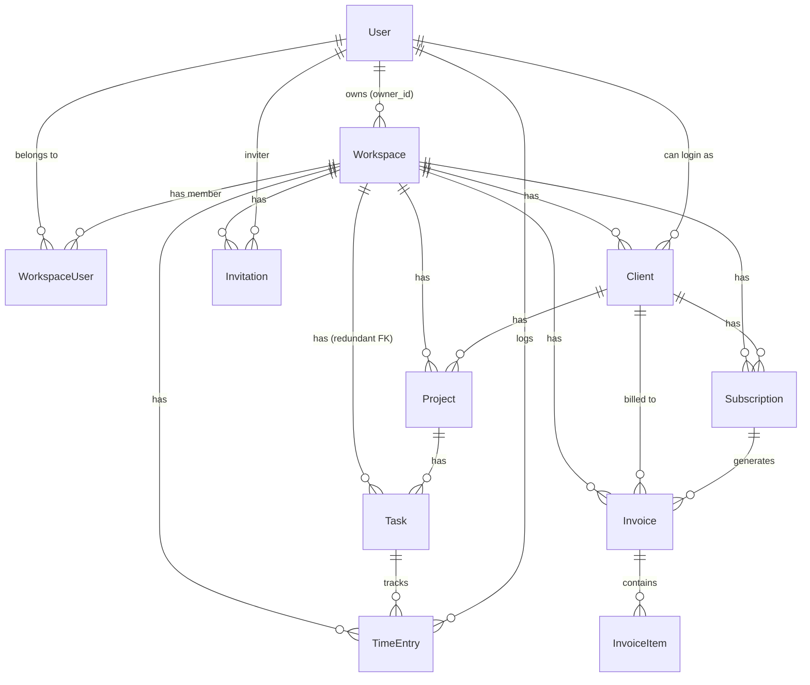

# Database & Models Guide

## ER Diagram (Mermaid)

## UUID Primary Keys
- Every model must use `Illuminate\Database\Eloquent\Concerns\HasUuids`.
- `protected $keyType = 'string';`
- `public $incrementing = false;`

## Migrations
- Use `$table->uuid('id')->primary();` for primary keys.
- Use `$table->foreignUuid('xxx_id')->index();` for foreign keys.
- **CRITICAL:** NEVER use `->constrained()` on UUID foreign keys. PostgreSQL often fails with self-referencing or circular UUID dependencies. Handle referential integrity at the application level.
- Always include `$table->softDeletes();`.

## PostgreSQL Compatibility
- While local tests use SQLite, all Eloquent code and migrations MUST be 100% compatible with PostgreSQL.
- Avoid using DB-specific functions (like `json_contains`) directly; prefer Eloquent abstractions.
